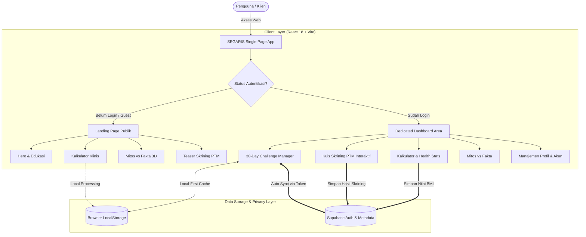

<div align="center">

  # SEGARIS
  ### *Sistem Edukasi Gaya Hidup & Nutrisi Sehat Terintegrasi*
  **"Masa Depan Sehat & Sejahtera Dimulai dari Langkah Kecil Hari Ini"**

  <p align="center">
    Inovasi platform kesehatan digital interaktif berbasis web untuk mewujudkan <b>Sustainable Development Goals (SDG) 3: Kehidupan Sehat dan Sejahtera (Good Health & Well-Being)</b>.
  </p>

  <p align="center">
    <a href="#-latar-belakang--urgensi"></a>
    <a href="#-teknologi-yang-digunakan"></a>
    <a href="#-teknologi-yang-digunakan"></a>
    <a href="#-arsitektur--keamanan-data"></a>
    <a href="#-kebijakan-privasi--keamanan-data-pengguna"></a>
  </p>

  ---
</div>

## 📑 Daftar Isi
- [📌 Latar Belakang & Urgensi](#-latar-belakang--urgensi)
- [🎯 Korelasi dengan SDG 3](#-korelasi-dengan-sdg-3)
- [✨ Fitur Utama & Inovasi Unggulan](#-fitur-utama--inovasi-unggulan)
- [🏗️ Arsitektur Sistem & Alur Kerja](#️-arsitektur-sistem--alur-kerja)
- [🛡️ Kebijakan Privasi & Keamanan Data Pengguna (Kepatuhan UU PDP)](#️-kebijakan-privasi--keamanan-data-pengguna-kepatuhan-uu-pdp)
- [🎨 Desain UI/UX & Filosofi Estetika](#-desain-uiux--filosofi-estetika)
- [💻 Teknologi yang Digunakan](#-teknologi-yang-digunakan)
- [🚀 Panduan Instalasi & Menjalankan Aplikasi](#-panduan-instalasi--menjalankan-aplikasi)
- [📁 Struktur Direktori Proyek](#-struktur-direktori-proyek)
- [👥 Tim Pengembang](#-tim-pengembang)

---

## 📌 Latar Belakang & Urgensi

Di era modern, pergeseran pola konsumsi masyarakat Indonesia ke arah makanan tinggi kalori, gula, garam, dan lemak jenuh (GGL), dipadukan dengan gaya hidup sedentari (*sedentary lifestyle*), telah memicu lonjakan signifikan kasus **Penyakit Tidak Menular (PTM)** seperti Diabetes Melitus Tipe 2, Hipertensi, Obesitas, dan Penyakit Jantung Koroner. 

Faktor utama yang memperburuk kondisi ini antara lain:
1. **Rendahnya Literasi Gizi Klinis**: Maraknya disinformasi, mitos diet ekstrem tanpa dasar medis, serta klaim produk kesehatan semu (*pseudoscience*) di media sosial.
2. **Ketiadaan Alat Skrining Mandiri yang Terjangkau & Holistik**: Kebanyakan masyarakat baru mengetahui kondisi kesehatannya ketika komplikasi klinis telah terjadi.
3. **Barrier Aplikasi Kesehatan Konvensional**: Aplikasi yang ada seringkali rumit, berbayar mahal, dibanjiri iklan invasif, dan mengeksploitasi data privasi pengguna tanpa transparansi.

**SEGARIS** hadir sebagai jembatan edukatif dan preventif interaktif: platform web kesehatan berbasis bukti medis (*evidence-based*) yang mudah diakses oleh seluruh lapisan masyarakat secara gratis, ramah pengguna, berorientasi privasi, dan menyenangkan.

---

## 🎯 Korelasi dengan SDG 3

Proyek ini secara spesifik mengusung subtema **SDGs 3: Kehidupan Sehat dan Sejahtera (Good Health and Well-Being)** dengan fokus kontribusi nyata pada:

* **Target 3.4**: *Mengurangi sepertiga kematian dini akibat penyakit tidak menular (PTM) melalui pencegahan dan pengobatan, serta mempromosikan kesehatan mental dan kesejahteraan.*
  > **Realisasi SEGARIS**: Menyediakan modul skrining mandiri faktor risiko PTM (Diabetes, Hipertensi, Jantung), kalkulasi energi & hidrasi terpersonalisasi, serta edukasi gizi preventif sebelum timbul gejala kronis.
* **Target 3.d**: *Memperkuat kapasitas deteksi dini, pengurangan risiko, dan pengelolaan risiko kesehatan nasional dan global.*
  > **Realisasi SEGARIS**: Memberdayakan individu dengan data kesehatan objektif (BMI, TDEE, Profil Risiko) dan rekomendasi tindakan personal untuk perubahan gaya hidup bertahap.

---

## ✨ Fitur Utama & Inovasi Unggulan

### 1. 🧮 Kalkulator Kesehatan Klinis Interaktif (Multi-Parameter)
Bukan sekadar kalkulator sederhana, modul kalkulator SEGARIS menggunakan formula medis standar internasional:
- **Indeks Massa Tubuh (BMI)**: Mengadopsi standar batas *Asia-Pacific WHO Guidelines*. Hasil kalkulasi secara cerdas terintegrasi (*auto-sync*) ke modul Kuis Skrining sebagai parameter objektif pertama.
- **Kebutuhan Kalori Harian (TDEE & BMR)**: Dihitung menggunakan **Persamaan Mifflin-St Jeor** (standar emas klinis terkini yang lebih akurat dibandingkan rumus Harris-Benedict lama), dikombinasikan dengan faktor aktivitas fisik (*Physical Activity Level*).
- **Kalkulator Kebutuhan Air (Hidrasi)**: Estimasi volume cairan berbasis berat badan (35 ml/kg) yang disesuaikan secara dinamis dengan intensitas beban aktivitas harian.

### 2. 🩺 Kuis Skrining Risiko PTM (Early Risk Assessment)
- **Algoritma Skor Berbobot (Weighted Risk Scoring)**: 10 indikator terstruktur yang mencakup integrasi BMI riil, pola makan (sayur/buah, konsumsi gula, gorengan/lemak trans, natrium), aktivitas fisik (standar WHO 150 menit/minggu), riwayat genetik keluarga, paparan tembakau (aktif/pasif), durasi tidur, dan tingkat stres harian.
- **Stratifikasi Risiko 4-Tingkat**: Mengkategorikan pengguna ke dalam *Risiko Rendah*, *Risiko Sedang*, *Risiko Tinggi*, dan *Risiko Sangat Tinggi*.
- **Sub-Kategori Analitik**: Memberikan diagnosis visual terhadap 3 domain utama: *Risiko Metabolik*, *Risiko Kardiovaskular*, dan *Risiko Gaya Hidup*.
- **Triggered Actionable Recommendations**: Menghasilkan daftar rekomendasi personal konkret berdasarkan respon spesifik yang memicu skor bahaya pengguna.

### 3. 🃏 Mitos vs Fakta Gizi (Interactive 3D Card Flip)
- Modul edukasi interaktif untuk meluruskan 6 miskonsepsi diet populer (misal: mitos air es membekukan lemak, bahaya melewatkan sarapan, pembatasan buah saat diet, makan malam, hingga mitos diet jus detoks).
- Desain *card-flip* 3D dengan visualisasi ergonomis dan penjelasan ilmiah ringkas namun berbasis literatur medis.

### 4. 🔥 30-Day Health Habit Challenge (Gamified Habit Formation)
- Menerapkan prinsip *behavioral habit loops* untuk membangun kebiasaan sehat berkelanjutan.
- **Fleksibilitas Target Kustom**: Pengguna dapat menambahkan target kuantitatif (Liter, Menit, Porsi) maupun boolean dengan frekuensi yang dapat diatur (harian, 2 hari sekali, mingguan).
- **Indikator Real-time**: Streak api aktif, persentase keberhasilan harian, log kalender 30 hari, serta pencatatan otomatis.

### 5. 🔄 Arsitektur Dual-State (Guest Landing Page vs. Dedicated Dashboard)
- **Guest / Publik**: Landing page imersif dengan *single-page storytelling* dan akses instan ke edukasi tanpa registrasi yang memaksa.
- **Authenticated User**: Dashboard pribadi *distraction-free* dengan navigasi sidebar lateral (*1 feature per page*), riwayat kuis, sinkronisasi cloud, dan manajemen akun mandiri.

---

## 🏗️ Arsitektur Sistem & Alur Kerja



---

## 🛡️ Kebijakan Privasi & Keamanan Data Pengguna (Kepatuhan UU PDP)

SEGARIS mengedepankan prinsip *Privacy-by-Design*:

| Prinsip Keamanan | Implementasi pada SEGARIS |
|---|---|
| **Local-First Processing** | Perhitungan BMI, kalori, dan kebutuhan air dilakukan langsung di mesin pengguna (*client-side*). Data tidak dikirimkan ke server jika pengguna tidak login. |
| **Kepatuhan Regulasi** | Dirancang dengan mengacu pada prinsip transparansi dan persetujuan **UU Perlindungan Data Pribadi (UU No. 27 Tahun 2022)**. |
| **Zero Ad-Trackers** | 100% bebas dari pelacak iklan pihak ketiga (*no third-party tracking cookies* / *no telemetry surveillance*). |
| **Enkripsi Cloud & RLS** | Data akun yang disinkronisasi ke basis data Supabase dilindungi protokol enkripsi TLS serta otentikasi ketat berbasis token JWT. |
| **Right to be Forgotten** | Tersedia mekanisme **Hapus Akun Permanen 2-Langkah** di menu profil, menjamin hak pengguna untuk menghapus seluruh metadata dan riwayat kesehatannya kapan pun. |

---

## 🎨 Desain UI/UX & Filosofi Estetika

Desain antarmuka SEGARIS mengusung estetika **Modern Botanical & Clinical Elegance** yang menenangkan:
* **Palet Warna Harmonis**:
  - `Forest Green (#2F6323)`: Menyimbolkan vitalitas, kesegaran, dan pertumbuhan kesehatan.
  - `Sage Green (#558949)`: Warna aksen sekunder yang ramah dan menyejukkan mata.
  - `Warm Cream (#FAF9F6)`: Mengurangi ketegangan mata (*eye-strain reduction*) dibandingkan latar putih murni.
  - `Slate Dark (#1E293B)`: Menjamin rasio kontras teks yang memenuhi standar aksesibilitas WCAG AA/AAA.
* **Tipografi Terkurasi**:
  - *Fraunces* & *Lora*: Memberikan sentuhan editorial bergengsi dan ramah (*approachable editorial tone*).
  - *Plus Jakarta Sans*: Sans-serif modern karya desainer Indonesia yang memiliki *readability* tinggi pada layar digital.
* **Mikro-Interaksi Halus**:
  - Animasi rotasi ikonik pada kartu mitos vs fakta.
  - State indikator interaktif dan transisi mulus saat perpindahan navigasi.

---

## 💻 Teknologi yang Digunakan

| Kategori | Teknologi | Kegunaan |
|---|---|---|
| **Core Framework** | React 18.3 | Library komponen antarmuka reaktif dan modular |
| **Build Tool** | Vite 6.1 | Modul bundler ultra-cepat dengan Hot Module Replacement (HMR) instan |
| **Styling** | Vanilla Modern CSS | Performa render maksimal, arsitektur modular tanpa overhead Tailwind runtime |
| **Iconography** | Lucide React | Ikon modern, konsisten, dan ringan berformat SVG murni |
| **Backend & Auth** | Supabase JS v2 | Layanan autentikasi akun, penyimpanan metadata pengguna, dan sinkronisasi awan |
| **Design Standards** | Figma & Web Standards | Rancang bangun antarmuka responsif ramah seluler (*mobile-first*) |

---

## 🚀 Panduan Instalasi & Menjalankan Aplikasi

Ikuti panduan ringkas berikut untuk menjalankan SEGARIS di lingkungan lokal (*local development*):

### 1. Prasyarat Sistem
* [Node.js](https://nodejs.org/) (versi 18.x atau yang lebih baru direkomendasikan)
* NPM atau Yarn package manager
* Git

### 2. Kloning Repositori
```bash
git clone https://github.com/dababayou/SEGARIS.git
cd SEGARIS
```

### 3. Instalasi Dependensi
```bash
npm install
```

### 4. Konfigurasi Environment Variables
Salin file template lingkungan `.env.example` menjadi `.env`:
```bash
cp .env.example .env
```
Sesuaikan kredensial Supabase Anda di dalam `.env`:
```env
VITE_SUPABASE_URL=https://your-project-id.supabase.co
VITE_SUPABASE_ANON_KEY=your-supabase-anon-key
```
> *Catatan: Jika kredensial Supabase dikosongkan, SEGARIS secara otomatis mengaktifkan **Mode Mock/Demo Terintegrasi** sehingga penguji juri tetap dapat mengeksplorasi seluruh fitur akun secara penuh tanpa kendala koneksi.*

### 5. Menjalankan Server Development
```bash
npm run dev
```
Buka peramban dan navigasikan ke `http://localhost:3000`.

### 6. Membangun Bundle Produksi
```bash
npm run build
npm run preview
```

---

## 📁 Struktur Direktori Proyek

```text
SEGARIS/
├── assets/                     # Aset gambar grafis, kartu interaktif, & palet
├── public/                     # Aset statis (Favicon, Logo SEGARIS, Ilustrasi)
│   ├── hero_bg.png
│   └── logo.png
├── src/
│   ├── components/             # Komponen modular aplikasi
│   │   ├── AuthPage.jsx        # Halaman autentikasi login & registrasi split-view
│   │   ├── Challenge30Days.jsx # Modul pelacak kebiasaan 30-Day Challenge
│   │   ├── DashboardLayout.jsx # Tata letak dashboard pengguna dengan sidebar
│   │   ├── Footer.jsx          # Komponen footer dan rincian lisensi
│   │   ├── Hero.jsx            # Banner pengantar landing page dengan tipografi
│   │   ├── Kalkulator.jsx      # Kalkulator BMI, Mifflin-St Jeor, & Hidrasi
│   │   ├── KuisSkrining.jsx    # Kuis 10 indikator risiko PTM & rekomendasi
│   │   ├── KuisTeaser.jsx      # Pratinjau kuis interaktif untuk tamu
│   │   ├── MitosFakta.jsx      # Kartu edukasi nutrisi 3D Flip
│   │   ├── Navbar.jsx          # Navigasi utama dengan deteksi sesi
│   │   ├── PrivacyModal.jsx    # Modal kebijakan privasi data pengguna
│   │   ├── ProfileModal.jsx    # Manajemen profil dan hapus akun
│   │   └── Sidebar.jsx         # Navigasi sidebar terpadu untuk dashboard
│   ├── lib/
│   │   └── supabase.js         # Konfigurasi klien dan validasi koneksi Supabase
│   ├── App.jsx                 # Pengatur status aplikasi utama & router tampilan
│   ├── index.css               # Desain sistem global, variabel CSS, & tipografi
│   └── main.jsx                # Titik masuk utama React DOM
├── .env.example                # Templat variabel lingkungan
├── index.html                  # Dokumen HTML utama dengan konfigurasi SEO
├── package.json                # Rincian paket dependensi dan script eksekusi
└── vite.config.js              # Konfigurasi bundler Vite
```

---


## 👥 Tim Pengembang

Proyek ini dirancang dan dikembangkan dengan penuh dedikasi oleh:

* **Idea, Concept, and Documentation**: Chelsea Franssiska Putri Gautama
* **UI/UX Designer and QA**: Kevin Marcelino Porobaten
* **Fullstack Developer**: Bayu Nismara Nagatama

---

<div align="center">
  <p>Dibuat dengan ❤️ untuk Masa Depan Indonesia yang Lebih Sehat & Berkelanjutan.</p>
  <p><b>SEGARIS © 2026 — All Rights Reserved.</b></p>
</div>
